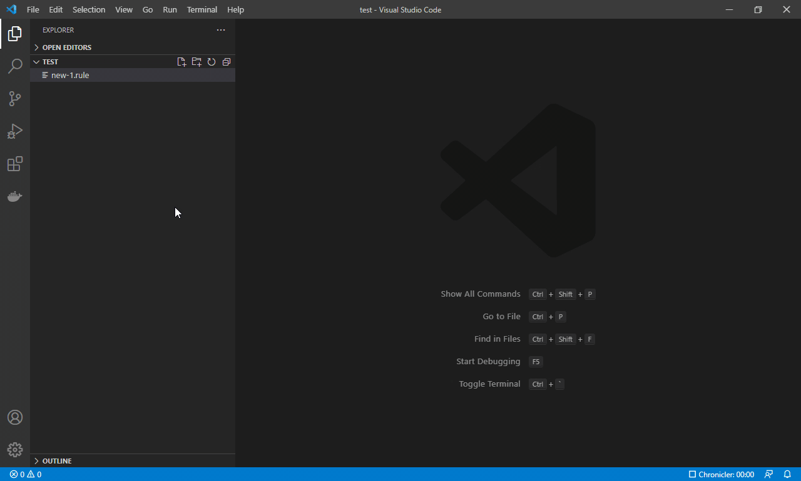

# VS Code Rule Engine Editor

A custom editor extension for Visual Studio Code which provides a pipeline editor to control the flow of executable code through a visual representation of a node graph.

## License

[MIT](LICENSE)
